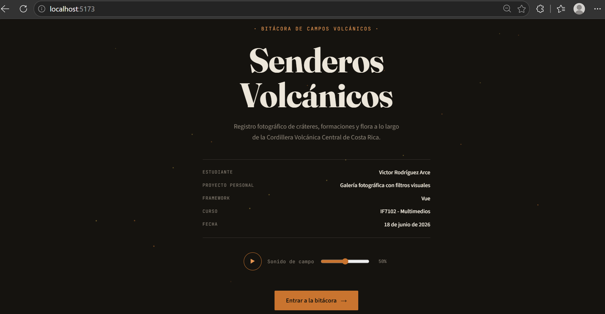
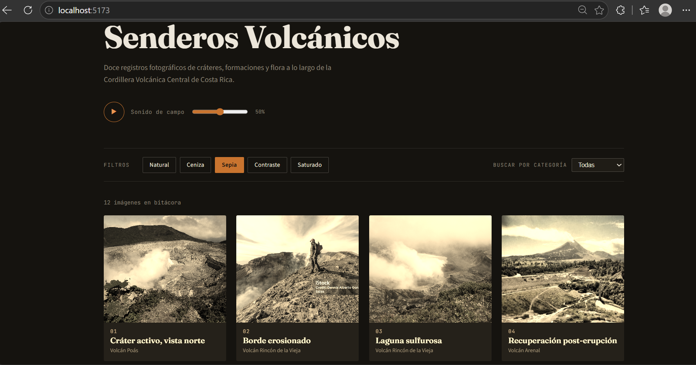
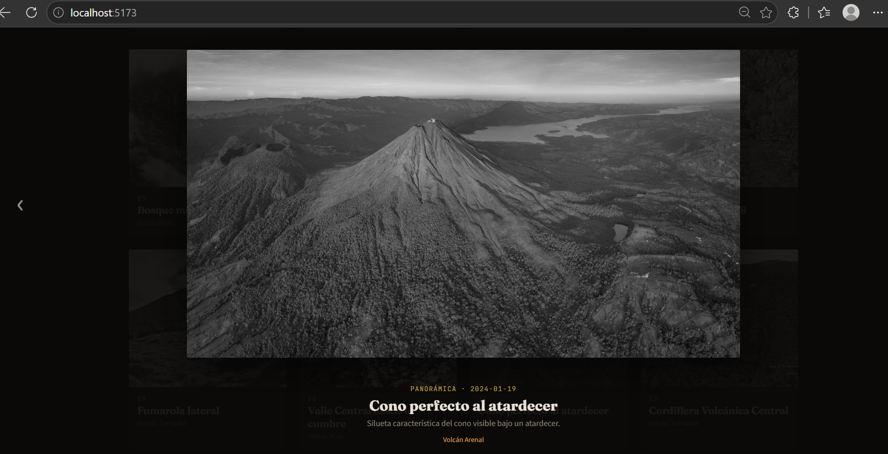
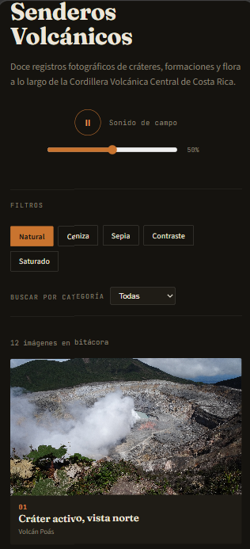

# Bitácora de Senderos Volcánicos — Galería Fotográfica con Filtros Visuales

**Estudiante:** Victor Rodríguez Arce
**Proyecto:** Galería fotográfica con filtros visuales
**Curso:** IF7102 - Multimedios

Aplicación construida con **Vue 3**. Muestra 12 fotografías de senderos volcánicos de Costa Rica, organizadas por categoría, con filtros visuales en tiempo real, lightbox propio, audio ambiental con control de volumen y persistencia de estado durante la sesión.

## Framework utilizado

**Vue 3**, usando la **Options API** (`data`, `computed`, `methods`, `props`, `emits`, `mounted`, `watch`), junto con `reactive()` de la Composition API para los stores compartidos (`audioStore.js` y `uiStore.js`).

## Funcionalidades implementadas

- Estado reactivo para la vista activa, el filtro visual activo, la categoría activa y la foto seleccionada en el lightbox.
- `computed` para filtrar las fotos por categoría y para mapear el filtro elegido a su valor CSS real.
- `props` para pasar la metadata de cada foto desde `Galeria.vue` hacia `TarjetaFoto.vue` y `Lightbox.vue`.
- `ref` para acceder al único elemento `<audio>` del DOM y controlar `play()`, `pause()` y `volume`.
- `fetch()` para cargar dinámicamente la metadata de las 12 fotografías desde `public/fotos.json`, con estado de carga y manejo de error.
- Filtros CSS controlados: natural, escala de grises (ceniza), sepia, contraste y saturación.
- Lightbox construido desde cero (sin librerías de UI externas), con navegación por clic, botones y teclado.
- Portada de presentación con los datos del proyecto, antes de entrar a la galería.
- Dos pistas de audio ambiental distintas (una para la portada, otra para la galería), reproducidas por un único reproductor que cambia de pista según la vista activa, con control de volumen compartido.
- Persistencia en `sessionStorage`: la vista activa, el filtro, la categoría, la última foto abierta, el volumen y si el audio estaba sonando se mantienen si se refresca la página, pero se reinician al cerrar y volver a abrir el navegador.

## Estructura del proyecto

```
galeria-fotografica/
├── index.html
├── package.json
├── vite.config.js
├── README.md
├── REFERENCIAS.md
├── public/
│   ├── fotos.json                    
│   ├── fotos/                        
│   └── audio/
│       ├── bienvenida-portada.mp3    
│       └── viento-cratere.mp3        
└── src/
    ├── main.js
    ├── App.vue                       
    ├── style.css
    ├── store/
    │   ├── audioStore.js              
    │   └── uiStore.js                 
    └── components/
        ├── Portada.vue
        ├── ControlAudio.vue
        ├── Galeria.vue
        ├── FiltroBar.vue
        ├── TarjetaFoto.vue
        └── Lightbox.vue
```

## Instrucciones de ejecución

1. Clonar o descargar el repositorio.
2. Instalar las dependencias:
   ```bash
   cd galeria-fotografica
   npm install
   ```
3. Levantar el servidor de desarrollo:
   ```bash
   npm run dev
   ```
4. Abrir en el navegador la URL que indique la terminal (por defecto `http://localhost:5173`).


## Capturas de pantalla


**Portada**



**Galería con filtro aplicado**



**Lightbox**



**Vista en móvil**




